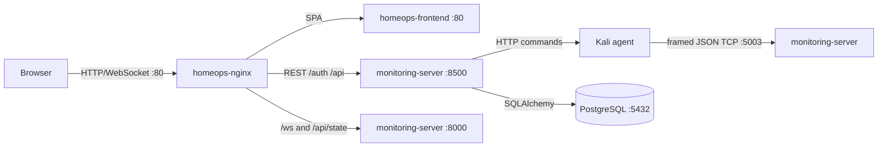

# HomeOps
## Infrastructure Management & Monitoring Platform

HomeOps is a two-host monitoring and Docker-control application. A Kali-side Python agent collects host telemetry and exposes a command receiver. A Windows-side Python service accepts telemetry, stores selected records in PostgreSQL, exposes REST and WebSocket interfaces, and serves a React dashboard through Nginx.

This documentation follows the implementation currently present in the repository. Security and deployment limitations are part of the current status.

## Architecture



Compose defines `postgres`, `monitoring-server`, `frontend`, and `nginx` on the `homeops` bridge network. Kali is external to Compose and connects to the Windows host using `WINDOWS_HOST`.

## Implemented Surface

- Length-prefixed TCP telemetry for hardware, network, process, Docker, event, and heartbeat messages.
- In-memory current state, WebSocket broadcasts, and 30-second heartbeat offline detection.
- PostgreSQL persistence for hosts, metrics, events, HTTP request logs, heartbeats, users, refresh tokens, and audit logs.
- HS256 JWT access/refresh authentication, bcrypt password hashes, and `admin`, `operator`, and `viewer` roles.
- REST history, host status, HTTP monitoring, Docker state, and Docker control APIs.
- React/Vite routes for dashboard, infrastructure, Docker, network, processes, events, history, HTTP monitoring, settings, and users.

## Data Flow

Kali sends UTF-8 JSON over TCP using a 4-byte big-endian length prefix. The Windows listener updates state, broadcasts a snapshot, and queues selected database writes. Browser REST calls go through Nginx to port `8500`; `/ws` and `/api/state` go to port `8000`. Docker commands are forwarded from the gateway to the Kali command receiver at `KALI_COMMAND_URL`.

## Repository

```text
Kali_Machine/       Telemetry sender, collectors, monitors, command receiver
Windows_Machine/    Listener, FastAPI gateway, auth, database, frontend, Compose
docs/               Architecture, networking, security, API, deployment, protocol
diagrams/           Repository diagrams
```

## Configuration and Running

Copy the relevant `.env.example` to `.env` and provide secrets and host values. Windows requires `HOMEOPS_API_KEY`, `JWT_SECRET`, `DATABASE_URL`, and `KALI_COMMAND_URL`. Kali requires `HOMEOPS_API_KEY`, `JWT_SECRET`, and `WINDOWS_HOST`. Never commit real values. See [docs/CONFIGURATION.md](docs/CONFIGURATION.md).

From `Windows_Machine`, run `docker compose up --build`; Nginx publishes host port `80` and the telemetry listener publishes host port `5003`. For local development, install Python requirements in each machine directory and use `npm install`, `npm run dev`, `npm run build`, or `npm run lint` in the frontend directory.

## Security and Status

JWT/RBAC and password hashing are implemented, but telemetry TCP has no authentication or encryption; TLS is not configured; CORS allows all origins with credentials; browser tokens use `localStorage`; and startup seeds `admin` / `admin123` when absent. The gateway API-key fallback references nonexistent `WindowsConfig.API_KEY`. Two secondary frontend WebSocket hooks omit tokens and therefore rely on polling. No migration scripts were found. The current deployment is not verified as production-ready.

See [docs/ARCHITECTURE.md](docs/ARCHITECTURE.md), [docs/API.md](docs/API.md), [docs/TELEMETRY_PROTOCOL.md](docs/TELEMETRY_PROTOCOL.md), and [docs/TROUBLESHOOTING.md](docs/TROUBLESHOOTING.md).

## License

No license file or license declaration was found. Licensing is not verified.
