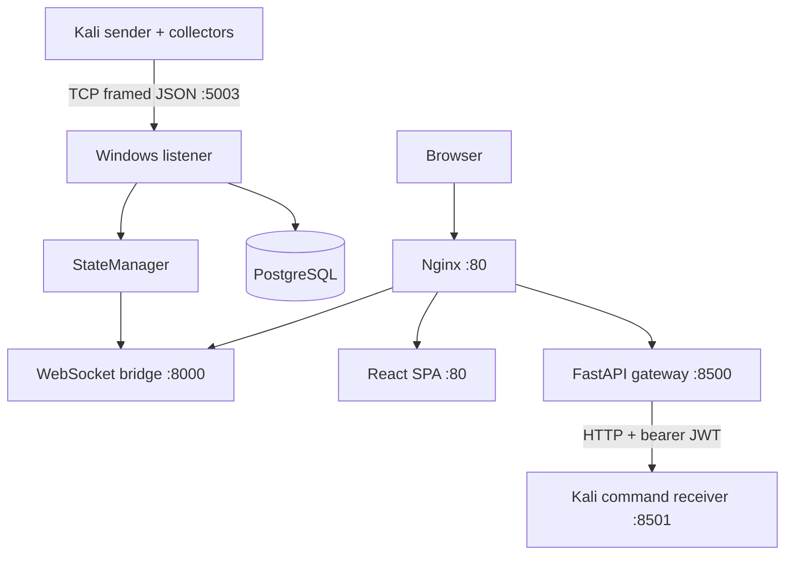

# Architecture

## System Context

HomeOps has an external Kali agent and a Windows-hosted Compose stack. Kali collects local metrics and sends them to the Windows TCP listener. The Windows service maintains current state, persists selected data, and exposes dashboard interfaces.

## Boundaries and Flows

The TCP listener, web bridge, and gateway run as threads in one Python process. PostgreSQL is a separate container. Nginx and the frontend are separate containers. Kali is outside the Docker bridge. Telemetry is decoded by `recv_exact`, dispatched by message type, copied into locked state, broadcast, and selectively queued to the database. Browser authentication is handled by the gateway; Docker control crosses the gateway-to-Kali HTTP boundary.

WebSocket upgrades require a JWT in `?token=` or a bearer header. The raw `/api/state` fallback returns the current snapshot without a demonstrated authentication check in the bridge. The main frontend hook uses the WebSocket token; two secondary hooks omit it.

## Persistence

Tables are `hosts`, `hardware_metrics`, `docker_metrics`, `connection_events`, `http_request_logs`, `host_heartbeat`, `users`, `refresh_tokens`, and `audit_logs`. Foreign keys link metrics/events/heartbeats to hosts and tokens/audit rows to users. Startup calls `Base.metadata.create_all()`. Alembic is a dependency, but migrations are not present.

## Why This Architecture?

The implementation separates collection from control: the Kali process has local system and Docker access, while Windows owns aggregation, authentication, persistence, and UI delivery. Threaded listeners allow the three Windows interfaces to share in-memory state. This is an observed implementation rationale, not a claim of production scale or security.

## Status

Core telemetry, persistence, REST, authentication, and dashboard routes are implemented. TCP ingestion is unauthenticated; command fallback is broken; some WebSocket consumers are incomplete; TLS, firewall policy, payload limits, migration execution, and end-to-end deployment verification are not implemented or not verified.
