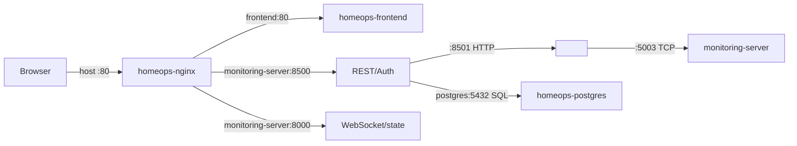

# Networking

## Topology

## Ports and Bindings

| Path | Source | Destination | Transport | Auth |
|---|---|---|---|---|
| Browser to Nginx | browser | `<WINDOWS_HOST>:80` | HTTP/WS upgrade | JWT at application paths |
| Nginx to frontend | `homeops-nginx` | `frontend:80` | HTTP | Nginx network |
| Nginx to gateway | `homeops-nginx` | `monitoring-server:8500` | HTTP | gateway JWT for protected routes |
| Nginx to bridge | `homeops-nginx` | `monitoring-server:8000` | HTTP/WS | JWT on WebSocket upgrade; state fallback not verified |
| Kali to listener | `<KALI_HOST>` | `<WINDOWS_HOST>:5003` | TCP | none implemented |
| Gateway to Kali | `monitoring-server` | `<KALI_HOST>:8501` | HTTP | bearer JWT in normal path |
| Gateway to database | `monitoring-server` | `postgres:5432` | PostgreSQL | database credentials |

The Compose bridge is named `homeops`; Docker DNS uses service names. Only host ports `80` and `5003` are published by Compose. Port `8501` is a Kali host port, outside Compose. `0.0.0.0` is used for server binds; it is not a remote hostname. No static private IP is hard-coded in the current Compose or Nginx configuration. Firewall rules are not included and must permit the required cross-host connections.

## Development vs Deployment

Local Vite development commonly uses its own dev server, while Compose serves the built frontend through Nginx. The frontend defaults to same-origin paths. Production TLS, restricted ingress, and a controlled firewall are not configured in this repository.
